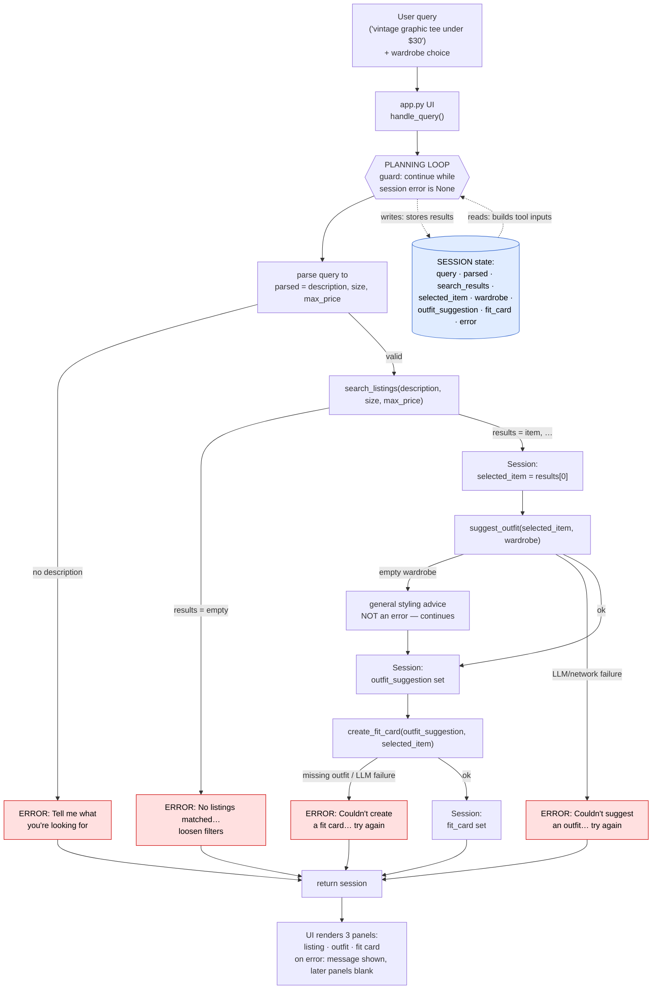

# FitFindr 🛍️

FitFindr is a multi-tool AI agent for secondhand shopping. You give it a natural-language
request ("vintage graphic tee under $30") and it orchestrates three tools — searching mock
listings, styling the find against your wardrobe, and writing a shareable caption — through a
**planning loop that branches on what each tool returns** rather than running a fixed pipeline.

FitFindr takes a natural-language thrifting request and runs it through a planning loop that calls
tools in response to what each step returns: the parsed query triggers `search_listings`, a successful
match triggers `suggest_outfit` against the user's wardrobe, and a valid outfit triggers `create_fit_card`
to produce a shareable caption. Each tool owns its failure mode — if `search_listings` finds nothing the
agent stops and asks the user to loosen their size/price/keywords rather than calling the next tool with
empty input; if the wardrobe is empty `suggest_outfit` falls back to general styling advice instead of
specific combos; and if `create_fit_card` receives a missing or empty outfit it returns a clear error
message instead of crashing. State flows through a single session dict, so the item found in step one is
carried into the outfit and fit-card steps without the user re-entering anything.

---

## Setup

```bash
pip install -r requirements.txt
```

Set your Groq API key in a `.env` file (free key at [console.groq.com](https://console.groq.com)):

```
GROQ_API_KEY=your_key_here
```

Run the app:

```bash
python app.py          # opens a Gradio UI, usually http://localhost:7860
```

Run the agent from the CLI (two built-in scenarios):

```bash
python agent.py
```

Run the tests:

```bash
pytest
```

---

## Architecture



---

## Tool Inventory

The documented signatures below match the actual functions in [`tools.py`](tools.py).

### 1. `search_listings(description, size=None, max_price=None) → list[dict]`

- **Inputs:**
  - `description` (`str`) — free-text keywords, e.g. `"vintage graphic tee"`. Tokenized and matched
    case-insensitively against each listing's `title`, `description`, and `style_tags`.
  - `size` (`str | None`) — size filter, e.g. `"M"`. `None` skips it. Case-insensitive substring,
    so `"M"` matches a listing sized `"S/M"`.
  - `max_price` (`float | None`) — inclusive price ceiling. `None` skips it.
- **Output:** `list[dict]` — matching listings sorted by relevance (best first), so `result[0]` is the
  top match. Each dict has `id`, `title`, `description`, `category`, `style_tags`, `size`, `condition`,
  `price`, `colors`, `brand`, `platform`. Empty list when nothing matches.
- **Purpose:** Pure, local, deterministic search/ranking over the mock dataset (no LLM, no network).

### 2. `suggest_outfit(new_item, wardrobe) → str`

- **Inputs:**
  - `new_item` (`dict`) — a listing dict (the chosen item). Reads `title`, `category`, `style_tags`,
    `colors` to describe the piece.
  - `wardrobe` (`dict`) — has an `items` key holding a `list[dict]`; each item has `name`, `category`,
    `colors`, `style_tags`, optional `notes`. May be empty (`{"items": []}`).
- **Output:** `str` — outfit suggestions. With a populated wardrobe it names real pieces; with an empty
  wardrobe it gives general styling advice. (`""` signals an LLM failure — see Error Handling.)
- **Purpose:** Style the find against what the user owns, using the Groq LLM (`llama-3.3-70b-versatile`, temp ~0.7).

### 3. `create_fit_card(outfit, new_item) → str`

- **Inputs:**
  - `outfit` (`str`) — the outfit-suggestion string from `suggest_outfit`.
  - `new_item` (`dict`) — the listing dict; reads `title`, `price`, `platform`.
- **Output:** `str` — a 2–4 sentence casual OOTD caption that mentions the item name, price, and platform
  once each. Higher temperature (~0.9) so it varies across runs.
- **Purpose:** Turn the outfit into a shareable social-media caption.

---

## How the Planning Loop Works

`run_agent(query, wardrobe)` in [`agent.py`](agent.py) is **not** a fixed `a → b → c` pipeline. It runs
the tools in sequence only as long as each step produces something usable, and **branches to an early
return the moment it doesn't**. The single guard throughout is: *is `session["error"]` still `None`?*

1. **Parse** the query into `{description, size, max_price}` using deterministic regex (`_parse_query`).
   → *If no description can be extracted, set `error` and return — no tool is called.*
2. **Search.** Call `search_listings(...)`.
   → *Branch on the result:* if the list is **empty**, set `error` (naming what was searched and how to
   loosen it) and **return early** — `suggest_outfit` is never called with empty input. Otherwise,
   store `selected_item = results[0]` and continue.
3. **Suggest outfit.** Call `suggest_outfit(selected_item, wardrobe)`.
   → An **empty wardrobe is not a failure** — the tool returns general advice and the loop continues.
   → An **LLM failure** (empty/whitespace return) sets `error` and returns early — `create_fit_card`
   is never called.
4. **Create fit card.** Call `create_fit_card(outfit_suggestion, selected_item)`.
   → An **LLM failure** sets `error` and returns; the listing and outfit already in the session survive.
5. **Done** when `fit_card` is populated and `error` is `None`.

**Why this is a real planning loop, not a script:** different inputs produce different tool sequences.
`"vintage graphic tee under $30"` runs all three tools; `"designer ballgown size XXS under $5"` runs
only `search_listings` and then stops. If the agent called all three tools regardless of what
`search_listings` returned, the loop wouldn't be doing its job.

---

## State Management

All state for one interaction lives in a single **session dict**, created by `_new_session()` at the
start of `run_agent`. It is the single source of truth: the loop **writes** each tool's output into it
and **reads** from it to build the next tool's input. The tools themselves are stateless — they take
plain arguments and return plain values; only the loop touches the session.

| Field | Type | Written | Read by |
|-------|------|---------|---------|
| `query` | `str` | init | parse step |
| `parsed` | `dict` | after parse | `search_listings` call |
| `search_results` | `list[dict]` | after search | emptiness check, item selection |
| `selected_item` | `dict` | after non-empty search | `suggest_outfit` **and** `create_fit_card` |
| `wardrobe` | `dict` | init | `suggest_outfit` |
| `outfit_suggestion` | `str` | after suggest | `create_fit_card` |
| `fit_card` | `str` | after card | the UI |
| `error` | `str \| None` | any failure branch | loop guard + UI |

**The hand-off:** the item found by `search_listings` becomes `session["selected_item"]`, which is passed
*by reference* into both later tools — the user never re-enters it. Verified with an identity check: the
dict in the session **is the same object** (`is`) passed into `suggest_outfit` and `create_fit_card`, and
the `outfit_suggestion` string is exactly what `create_fit_card` consumed. Because every intermediate
result is stored, partial progress (listing + outfit) survives even when a later step fails.

---

## Error Handling Strategy

Every tool owns its failure mode — none crash, none fail silently. The loop translates a tool's failure
signal into a user-facing message and stops before feeding bad input downstream.

| Tool | Failure mode | Strategy | Concrete example from testing |
|------|-------------|----------|-------------------------------|
| `search_listings` | No matches | Returns `[]`; loop sets `error` with how to loosen filters and stops. | Query `"designer ballgown size XXS under $5"` → `[]` → `error = "No listings matched 'designer ballgown' size XXS under $5 — try raising the price, removing the size filter, or using broader keywords."`; `suggest_outfit` never ran (`outfit_suggestion` stayed `None`). |
| `suggest_outfit` | Empty wardrobe | **Not an error** — switches to a general-advice prompt and returns useful text. | Query `"flowy midi skirt under $40"` with the empty wardrobe returned general styling advice (delicate tops, cardigans) and the run completed normally to a fit card. |
| `suggest_outfit` | LLM/network error | Returns `""`; loop sets `error` and stops before `create_fit_card`. | Mocked `_chat → ""` in `tests/test_tools.py`; `suggest_outfit` returned `""` (loop hard-stop signal). |
| `create_fit_card` | Missing/empty outfit | Short-circuits **before any LLM call**, returns a descriptive message. | `create_fit_card("", item)`, `"   "`, and `None` all returned `"Can't create a fit card without an outfit suggestion."` with no API call (proven by a mock that raises if called). |
| `create_fit_card` | LLM/network error | Returns `""`; loop sets `error`. | Mocked `_chat → ""`; returned `""`. |

The shared Groq helper `_chat()` wraps every LLM call in a `try/except` and returns `""` on any failure
(missing key, network error, blank response), so a flaky model can never raise through a tool.

---

## Spec Reflection

**How the spec helped:** writing the per-tool failure modes in [`planning.md`](planning.md) *before*
coding forced a single, consistent convention — "a tool signals failure to the loop, the loop owns the
user message and the early return." That made the planning loop fall out almost mechanically: every step
is just `call tool → check its signal → branch or continue`. Without the spec, error handling would
likely have been scattered ad-hoc inside each tool.

**Where implementation diverged:** the spec's Step 2 said the loop would "parse the query" but didn't
pin down *how*. During implementation I chose **deterministic regex** (`_parse_query`) over an LLM-based
parser, because it's fast, offline, and unit-testable — and then went back and documented that choice in
`planning.md` so the spec matched the code. The spec was a starting point, not a straitjacket.

---

## AI Usage

The AI tool used throughout was **Claude (via Claude Code)**, working directly in the repo.

**Instance 1 — Implementing the three tools from the spec.**
I gave Claude each tool's `planning.md` block (inputs, return value, failure mode, and — for the LLM
tools — the prompt-design note) plus the `load_listings()` signature from `utils/data_loader.py`. Claude
produced `search_listings` (keyword-overlap scoring across title/description/tags), `suggest_outfit`, and
`create_fit_card`, plus shared `_chat`/`_tokenize` helpers. **What I directed/overrode:** I made the
failure conventions an explicit design decision rather than leaving them to the model — `suggest_outfit`
and `create_fit_card` return `""` on an LLM failure so the loop can hard-stop, and I chose a *hard-stop*
on LLM failure (set `session["error"]`) over the "continue with a fallback string" the AI initially
proposed. I then verified each tool in isolation (e.g. confirmed `create_fit_card` produced 3/3 unique
captions and skipped the LLM call entirely on empty input) before wiring anything together.

**Instance 2 — Implementing the planning loop and architecture diagram.**
I gave Claude the `Planning Loop` and `State Management` sections plus the architecture flowchart and the
existing `_new_session()` stub, and asked it to implement `run_agent()` matching the numbered branch
logic. Claude produced the loop and a regex `_parse_query`. **What I revised:** I had Claude render the
architecture as a **Mermaid** diagram, then override its first version — bare `[]`/`{}` characters inside
node labels break GitHub's Mermaid renderer, so we replaced them with plain text (`results = empty`,
`parsed = description, size, max_price`) to get it rendering. I also verified the loop *branches* (the
no-results query stops after `search_listings` and never calls the downstream tools) rather than trusting
that it ran.
