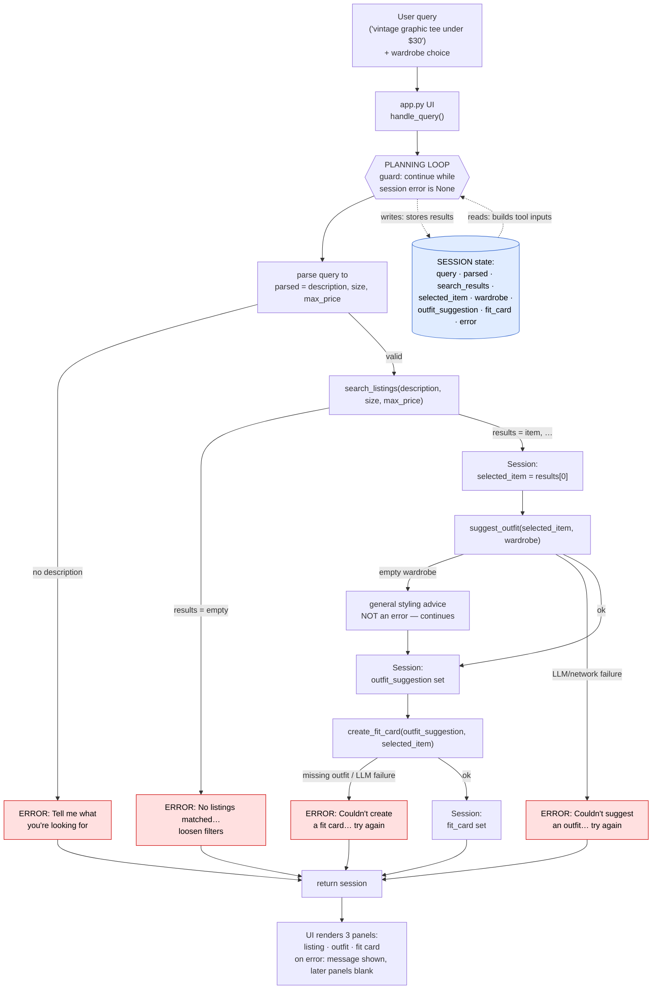

# FitFindr — planning.md

> Complete this document before writing any implementation code.
> Your spec and agent diagram are what you'll use to direct AI tools (Claude, Copilot, etc.) to generate your implementation — the more specific they are, the more useful the generated code will be.
> Your planning.md will be reviewed as part of your submission.
> Update it before starting any stretch features.

---

## Tools

List every tool your agent will use. For each tool, fill in all four fields.
You must have at least 3 tools. The three required tools are listed — add any additional tools below them.

### Tool 1: search_listings

**What it does:**
<!-- Describe what this tool does in 1–2 sentences -->
Searches the 40-item mock listings dataset for pieces matching the user's description, filtering by optional size and price ceiling, then ranking the survivors by how well their text/tags overlap the description. It is a pure local function (no LLM, no network) and never raises — it returns an empty list when nothing matches.

**Input parameters:**
<!-- List each parameter, its type, and what it represents -->
- `description` (str): free-text keywords describing the desired item, e.g. `"vintage graphic tee"`. Required. Tokenized and matched (case-insensitively) against each listing's `title`, `description`, and `style_tags`.
- `size` (str | None): size to filter by, e.g. `"M"`. Optional — `None` skips size filtering. Matching is case-insensitive and substring-based so `"M"` matches a listing sized `"S/M"`.
- `max_price` (float | None): inclusive price ceiling in dollars, e.g. `30.0`. Optional — `None` skips price filtering. Listings with `price <= max_price` are kept.

**What it returns:**
<!-- Describe the return value — what fields does a result contain? -->
`list[dict]` — the matching listings sorted by relevance score (highest first), so `result[0]` is the best match. The list is empty if nothing matches. Each dict is a full listing with these fields: `id` (str), `title` (str), `description` (str), `category` (str), `style_tags` (list[str]), `size` (str), `condition` (str), `price` (float), `colors` (list[str]), `brand` (str), `platform` (str). Listings that pass the size/price filters but score 0 on keyword overlap are dropped (not returned with a zero score).

**What happens if it fails or returns nothing:**
<!-- What should the agent do if no listings match? -->
The tool returns `[]` rather than raising. The planning loop treats an empty list as the no-results failure mode: it sets `session["error"]` to a helpful message (e.g. "No listings matched 'vintage graphic tee' under $30 — try raising the price, removing the size filter, or using broader keywords"), returns the session early, and does **not** call `suggest_outfit` with empty input. The user is told what to relax rather than seeing a crash or a silent empty result.

---

### Tool 2: suggest_outfit

**What it does:**
<!-- Describe what this tool does in 1–2 sentences -->
Given a thrifted item and the user's wardrobe, calls the Groq LLM to suggest 1–2 complete head-to-toe outfits built around that item. When the wardrobe has pieces, it proposes specific combos that name real wardrobe items; when the wardrobe is empty, it falls back to general styling advice for the item instead of inventing pieces the user doesn't own.

**Input parameters:**
<!-- List each parameter, its type, and what it represents -->
- `new_item` (dict): a single listing dict (typically `session["selected_item"]`, the top `search_listings` result). The tool reads fields like `title`, `category`, `style_tags`, and `colors` to describe the piece in the prompt.
- `wardrobe` (dict): the user's wardrobe with an `items` key holding a `list[dict]`. Each item dict has `id` (str), `name` (str), `category` (str: tops/bottoms/outerwear/shoes/accessories), `colors` (list[str]), `style_tags` (list[str]), and optional `notes` (str). The list may be empty (`{"items": []}`) for a new user — handled, not an error.

**What it returns:**
<!-- Describe the return value -->
`str` — a non-empty, human-readable block of outfit suggestions. With a populated wardrobe it references pieces by their `name` (e.g. "pair it with your *baggy straight-leg jeans* and *chunky white sneakers*"); with an empty wardrobe it returns general styling guidance (what categories/colors/vibes pair well). Always plain text suitable for direct display and for feeding into `create_fit_card`.

**What happens if it fails or returns nothing:**
<!-- What should the agent do if the wardrobe is empty or no outfit can be suggested? -->
Two distinct cases:
- **Empty/minimal wardrobe** (`wardrobe["items"]` is empty) — not treated as an error; the tool switches to the general-advice prompt and still returns useful styling text, so the loop proceeds normally to `create_fit_card`.
- **LLM/network error** (Groq call fails or returns an empty/whitespace string) — the tool does not crash; it surfaces the failure to the planning loop, which sets `session["error"]` to a helpful message (e.g. "Couldn't generate an outfit suggestion right now — please try again."), returns the session early, and does **not** call `create_fit_card`. This mirrors the hard-stop used for the no-results case in `search_listings`.

**Prompt design:**
A system message sets the role ("You are a thrift stylist who builds outfits from pieces the user already owns") and rules (suggest 1–2 complete head-to-toe looks; only reference wardrobe items by their exact `name`; never invent items the user doesn't own; keep it concise). The user message is built from state: the `new_item` (title, category, style_tags, colors) plus the wardrobe items formatted as a `name — category — style_tags` list. **Empty-wardrobe variant:** the rules switch to "the user has no wardrobe yet — give general styling advice (categories, colors, vibes that pair well)" and the wardrobe list is omitted. Temperature ~0.7.

---

### Tool 3: create_fit_card

**What it does:**
<!-- Describe what this tool does in 1–2 sentences -->
Takes the outfit suggestion and the thrifted item and calls the Groq LLM (at higher temperature) to write a short, casual, shareable caption — the kind of thing someone would post under an OOTD photo on Instagram or TikTok. It guards against empty input and is designed to read differently for different items/outfits rather than producing a templated description.

**Input parameters:**
<!-- List each parameter, its type, and what it represents -->
- `outfit` (str): the outfit-suggestion string from `suggest_outfit()` (`session["outfit_suggestion"]`). This is the styling content the caption is built around.
- `new_item` (dict): the listing dict for the thrifted piece (`session["selected_item"]`). The tool reads `title`, `price`, and `platform` so the caption can mention the find naturally — name, price, and platform once each.

**What it returns:**
<!-- Describe the return value -->
`str` — a 2–4 sentence caption in a casual, authentic voice that names the item, drops its price and platform once each, and captures the outfit's specific vibe. Higher LLM temperature makes the output vary across different inputs (and across runs) so it doesn't read like a product blurb. Always plain text ready to display or copy-paste.

**What happens if it fails or returns nothing:**
<!-- What should the agent do if the outfit data is incomplete? -->
Two cases, neither raising:
- **Missing/empty outfit** (`outfit` is `None`, empty, or whitespace-only) — the tool short-circuits before any LLM call and returns a descriptive error string (e.g. "Can't create a fit card without an outfit suggestion."). In practice the loop won't reach this tool with empty input, since a failed `suggest_outfit` already hard-stops at `session["error"]` — so this is a defensive guard.
- **LLM/network error** (Groq call fails or returns empty) — consistent with Tool 2, the tool surfaces the failure to the planning loop, which sets `session["error"]` to a helpful message and returns the session; `fit_card` stays `None`. The partial results already in the session (listing + outfit) remain available.

**Prompt design:**
A system message sets the voice ("You write casual OOTD captions for social media — authentic, a little playful, never a product description") and rules (2–4 sentences; mention the item name, price, and platform exactly once each; capture the outfit's specific vibe; no hashtag spam). The user message passes the `new_item` details (title, price, platform) and the `outfit` string. Temperature ~0.9 so captions vary across runs and inputs.

---

### Additional Tools (if any)

<!-- Copy the block above for any tools beyond the required three -->

---

## Planning Loop

**How does your agent decide which tool to call next?**
<!-- Describe the logic your planning loop uses. What does it look at? What conditions change its behavior? How does it know when it's done? -->
The loop is driven by what each tool returns and the current state of the session dict, not a fixed call order. After every step it inspects the result and decides whether to advance, branch to an error, or stop. `run_agent(query, wardrobe)` proceeds as follows:

1. **Initialize.** Call `_new_session(query, wardrobe)`. `session["error"]` starts as `None`; the loop only continues while it stays `None`.

2. **Parse the query.** Extract `description`, `size`, `max_price` from `query` and store them in `session["parsed"]`.
   - *Branch:* if no usable `description` could be extracted (empty/whitespace), set `session["error"]` ("Tell me what kind of item you're looking for") and `return session`. Don't call any tool.

3. **Decide: search.** Because we have a valid description, call `search_listings(description, size, max_price)` and store the list in `session["search_results"]`.
   - *Branch — empty list:* set `session["error"]` ("No listings matched … — try raising the price, removing the size filter, or broader keywords") and `return session`. Do **not** call `suggest_outfit`.
   - *Branch — non-empty:* set `session["selected_item"] = search_results[0]` (top-ranked) and continue.

4. **Decide: suggest outfit.** Because `selected_item` is set, call `suggest_outfit(selected_item, wardrobe)` and store the string in `session["outfit_suggestion"]`.
   - *Note:* an empty wardrobe is **not** a branch here — the tool returns general advice and the loop proceeds normally.
   - *Branch — tool reports LLM/network failure (returns empty/whitespace or signals error):* set `session["error"]` ("Couldn't generate an outfit suggestion right now — please try again") and `return session`. Do **not** call `create_fit_card`.

5. **Decide: create fit card.** Because `outfit_suggestion` is non-empty, call `create_fit_card(outfit_suggestion, selected_item)` and store the string in `session["fit_card"]`.
   - *Branch — tool reports failure (empty/whitespace or signals error):* set `session["error"]` ("Couldn't generate a fit card right now — please try again") and `return session`. Listing and outfit remain in the session.

6. **Done.** `session["fit_card"]` is populated and `session["error"]` is `None`. `return session`.

**How it knows it's done:** the loop terminates when either (a) an error message is set — it returns immediately at that point — or (b) all three tools have run and `session["fit_card"]` is populated. The single guard condition throughout is "is `session["error"]` still `None`?": each tool's output is checked before the next tool is chosen, so the agent never feeds empty/failed output into a downstream tool.

---

## State Management

**How does information from one tool get passed to the next?**
<!-- Describe how your agent stores and accesses state within a session. What data is tracked? How is it passed between tool calls? -->
All state for a single user interaction lives in one **session dict**, created by `_new_session(query, wardrobe)` at the start of `run_agent`. This dict is the single source of truth — the planning loop writes each tool's output into it, and reads from it to build the next tool's input. Tools themselves stay stateless: they receive plain arguments and return plain values, and the loop is the only thing that touches the session. Nothing is passed through globals or re-entered by the user.

**Fields tracked (and who writes/reads them):**
- `query` (str) — the original user request. *Written* at init; *read* by the parse step.
- `parsed` (dict) — `{description, size, max_price}` from the parse step. *Written* after parsing; *read* to call `search_listings`.
- `search_results` (list[dict]) — ranked listings. *Written* from `search_listings`'s return; *read* to check for emptiness and to pick the top item.
- `selected_item` (dict) — `search_results[0]`, the chosen listing. *Written* by the loop after a non-empty search; *read* as input to both `suggest_outfit` and `create_fit_card`.
- `wardrobe` (dict) — the user's wardrobe, passed into `run_agent`. *Written* at init; *read* by `suggest_outfit`.
- `outfit_suggestion` (str) — `suggest_outfit`'s return. *Written* after that call; *read* as input to `create_fit_card`.
- `fit_card` (str) — `create_fit_card`'s return; the final artifact. *Written* last; *read* by the UI.
- `error` (str | None) — `None` until something fails. *Written* by any failure branch; *read* as the loop's guard condition and by the UI to decide what to show.

**How the hand-off works concretely:** the key flow the requirement calls out — the found item reaching the styling step without the user re-typing it — happens because `search_listings` returns into `session["search_results"]`, the loop assigns `session["selected_item"] = search_results[0]`, and the next call passes `session["selected_item"]` straight into `suggest_outfit(...)`. The same item dict then flows into `create_fit_card(...)`. Because every intermediate result is stored on the session, partial progress (e.g. listing + outfit) survives even when a later step fails and sets `error`.

---

## Error Handling

For each tool, describe the specific failure mode you're handling and what the agent does in response.

| Tool | Failure mode | Agent response |
|------|-------------|----------------|
| search_listings | No results match the query | Loop detects the empty list and stops before `suggest_outfit`. Sets `session["error"]` to a message that names what was searched and offers concrete fixes: *"No listings matched 'vintage graphic tee' under $30. Try raising your price ceiling, dropping the size filter, or using broader keywords (e.g. 'graphic tee' instead of 'vintage graphic tee')."* UI shows this in the listing panel; outfit and fit-card panels stay empty. |
| suggest_outfit | Wardrobe is empty | Not treated as an error — the tool detects `wardrobe["items"] == []` and switches to its general-advice prompt, returning real styling guidance for the item (categories, colors, and vibes that pair well) instead of named combos. Agent says something like *"You haven't added any wardrobe pieces yet, so here are general ways to style this:"* and the loop proceeds normally to `create_fit_card`. |
| create_fit_card | Outfit input is missing or incomplete | Tool short-circuits before any LLM call when `outfit` is `None`/empty/whitespace and returns *"Can't create a fit card without an outfit suggestion."* In the normal flow this can't happen (a failed `suggest_outfit` already hard-stops), so it's a defensive guard. If the LLM call itself fails, the loop sets `session["error"]` to *"Couldn't generate a fit card right now — please try again."* while keeping the listing and outfit already shown. |

---

## Architecture

<!-- Draw a diagram of your agent showing how the components connect:
     User input → Planning Loop → Tools (search_listings, suggest_outfit, create_fit_card)
                                                                          ↕
                                                                   State / Session
     Show what triggers each tool, how state flows between them, and where error paths branch off.
     ASCII art, a Mermaid diagram (https://mermaid.js.org/syntax/flowchart.html), or an embedded
     sketch are all fine. You'll share this diagram with an AI tool when asking it to implement
     the planning loop and each individual tool. -->

---

## AI Tool Plan

<!-- For each part of the implementation below, describe:
     - Which AI tool you plan to use (Claude, Copilot, ChatGPT, etc.)
     - What you'll give it as input (which sections of this planning.md, your agent diagram)
     - What you expect it to produce
     - How you'll verify the output matches your spec before moving on

     "I'll use AI to help me code" is not a plan.
     "I'll give Claude my Tool 1 spec (inputs, return value, failure mode) and ask it to implement
     search_listings() using load_listings() from the data loader — then test it against 3 queries
     before trusting it" is a plan. -->

**Milestone 3 — Individual tool implementations:**

**Milestone 4 — Planning loop and state management:**

---

## A Complete Interaction (Step by Step)

Write out what a full user interaction looks like from start to finish — tool call by tool call. Use a specific example query.

**Example user query:** "I'm looking for a vintage graphic tee under $30. I mostly wear baggy jeans and chunky sneakers. What's out there and how would I style it?"

**Step 1:**
<!-- What does the agent do first? Which tool is called? With what input? -->
The agent first parses the natural-language query into search parameters and stores them in `session["parsed"]`: `description="vintage graphic tee"`, `size=None` (none given), `max_price=30.0`. The "baggy jeans / chunky sneakers" mention is styling context, not a search filter, so it isn't used yet. It then calls `search_listings("vintage graphic tee", size=None, max_price=30.0)`.

**Step 2:**
<!-- What happens next? What was returned from step 1? What tool is called now? -->
`search_listings` returned a ranked list of matches (filtered to price ≤ $30, then keyword-scored) — top hit `lst_006 "Graphic Tee — 2003 Tour Bootleg Style"` ($24, depop), with `lst_033 "Vintage Band Tee"` ($19) close behind — stored in `session["search_results"]`. Because the list is non-empty, the loop selects the top result (`search_results[0]` → `lst_006`) into `session["selected_item"]` and calls `suggest_outfit(selected_item, wardrobe)`. *(If the list had been empty, the loop would instead set `session["error"]`, return early, and never reach this tool.)*

**Step 3:**
<!-- Continue until the full interaction is complete -->
`suggest_outfit` sees the example wardrobe is non-empty, formats its items into a prompt, and asks the LLM for specific combos — e.g. the bootleg tee with the *baggy straight-leg jeans* and *chunky white sneakers*, layered under the *vintage black denim jacket* — storing the string in `session["outfit_suggestion"]`. *(An empty wardrobe would fall back to general styling advice instead.)* The loop then calls `create_fit_card(outfit_suggestion, selected_item)`, which confirms the outfit string is non-empty and generates a casual, shareable caption mentioning the item name, $24 price, and depop once each, at higher temperature so it reads fresh — stored in `session["fit_card"]`. *(A missing/empty outfit would return an error string instead of crashing.)*

**Final output to user:**
<!-- What does the user actually see at the end? -->
Three panels — the top listing (title, price, condition, platform), the outfit idea, and the fit-card caption — all produced from the single original query, with state carried through the session dict the whole way.
